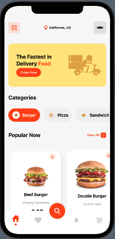

# FoodApp
> SwiftUI UI 구조 공부를 위한 tutorial, 2021.6.14 ~ 2021.6.16

[SwiftUI 2.0 Complex App UI - Food Ordering App UI - Custom Tab Bar - Custom Menu - SwiftUI Tutorials](https://www.youtube.com/watch?v=bO7VTH5Q9hQ)

* ScrollView(.horizontal/.vertial)
* ((조건) ? : ) 삼항 연산자를 통한 view change
* search button offset
* button with animation 

## WIL
- image 색 변경할 때 안되면 → image setting template mode로 바꾸면 됨, 혹은 .renderingMode(.template)

- TabView를 쓰게되면 기본 UITabView가 나오는데 이것의 appearance를 hidden으로 하고 custom tabview를 제작해야 원하는 tabview 형태를 만들 수 있음.

