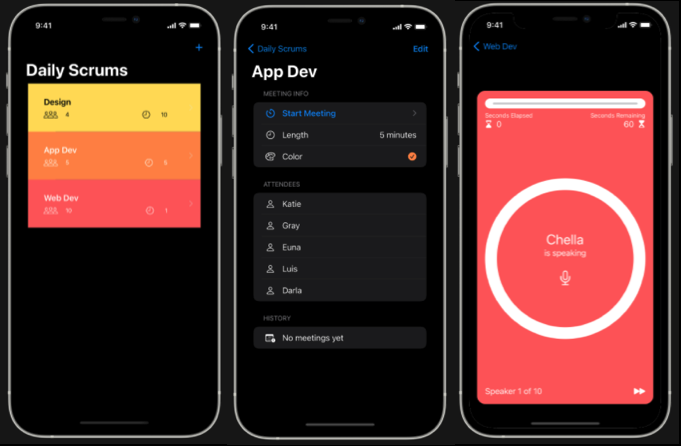

# Scrumdinger
> 진행한 첫 번째 SwiftUI tutorial, 2021.6.2 ~ 2021.6.4

[애플 공식 튜토리얼 링크](https://developer.apple.com/tutorials/app-dev-training/getting-started-with-scrumdinger)

* Daily Scrum 등록
* Daily Scrum 편집
    * Daily Scrum 참여자 정보, 각 Scrum 단위 길이, Component Color 편집
* Scrum 단위 길이에 따라 참여자 순서대로 Scrum 녹음
    * 참여자 스킵 기능 

## WIL

