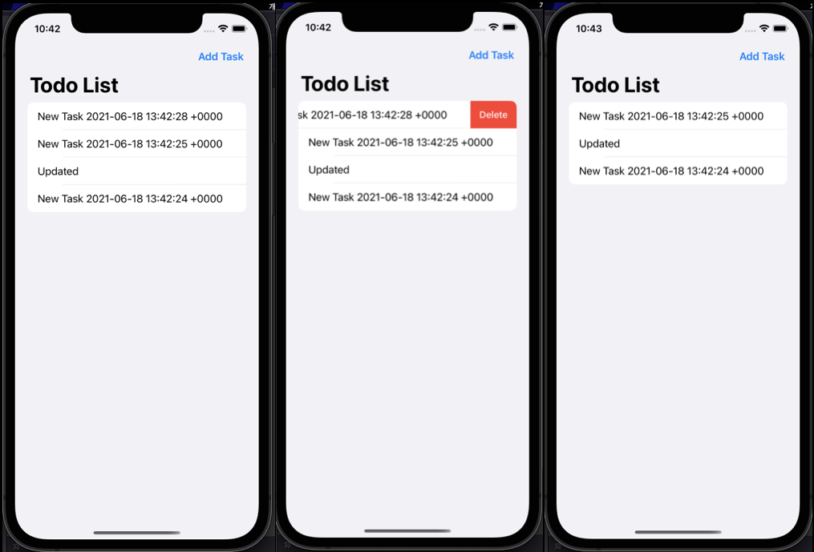
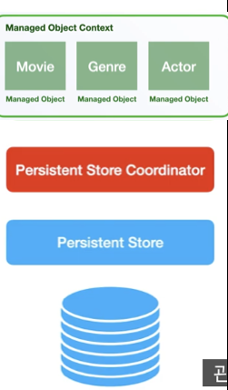

# Todolist
> SwiftUI with Core Data Tutorial, 2021.6.18

[SwiftUI 2.0: Core Data](https://www.youtube.com/watch?v=091Mdv_Rjb4)



* add todolist
* update task
* save in viewContext

## WIL

# Core Data?

- App에서 제공하는 애플 프레임워크
- 데이터 캐싱
- 변경 사항 추적이 용이함
- Object Graph Manager
- 모델간의 관계 뿐 아니라 아이폰 드라이브에 저장 등 데이터 지속 가능

# Core Data Stack

- Managed Objects



- Data Model File 사용하여 객체 그래프 수정
- Persistence Layer → data를 드라이브에 저강 및 다시 읽을 수 있는 형식으로 검색함
- Persistent Store Coordinator : 영구 저장소와 객체 그래프 간에 변경 사항 저장을 위한 레이어, 관리되는 객체와 영구 저장소간 통신 담당

# Core Data로 Todolist 만들기

- entity를 만들자마자 xcode는 자동으로 ns 관리 객체 클래스를 생성함.

Persistence.swift

```swift
import CoreData

struct PersistenceController{
    static let shared = PersistenceController()
    
    let container: NSPersistentContainer
    
    init(){
        container = NSPersistentContainer(name: "TodoList")
        
        container.loadPersistentStores{(NSPersistentStoreDescription, error) in
            if let error = error as NSError? {
                fatalError("Unresolved error: \(error)")
            }
        }
    }
}
```

`loadPersistentStores` : 컨테이너에 영구 저장소를 로드하도록 함. → 핵심 데이터 스택 생성

environment manage object context이 저장되는 **환경**이 현재의 ns manage context를 가지고 있음. → container로 접근 가능

⇒ 앱에서 이 환경을 설정해주어야 함.

TodoListApp.swift

```swift
import SwiftUI

@main
struct TodolistApp: App {
    var body: some Scene {
        let persistenceContainer = PersistenceController.shared
        WindowGroup {
            ContentView()
                .environment(\.managedObjectContext, persistenceContainer.container.viewContext)
        }
    }
}
```

contextview에 managedObjectContext path를 전달해야함 → PersistenceContainer에서 얻어올 수 있으므로 인스턴스를 만들어서 넘겨주어야 함.

Context는 ViewContext로 불러올 수 있음.

TodolistApp(main)의 자식 view인 contentview에서의 변경사항을 추적하기 위해 @Environment를 viewcontext로 선언함 → 변경사항을 추적하는 것 뿐만 아니라 안전하게 변경된 사항을 저장하기 위해 viewContext를 사용해야함.

`offsets.map { tasks[$0] }.forEach(viewContext.delete)` 

$0를 사용하여 task의 개별적인 요소를 가져오고, 각각의 요소에 viewcontext 정보를 넘김
