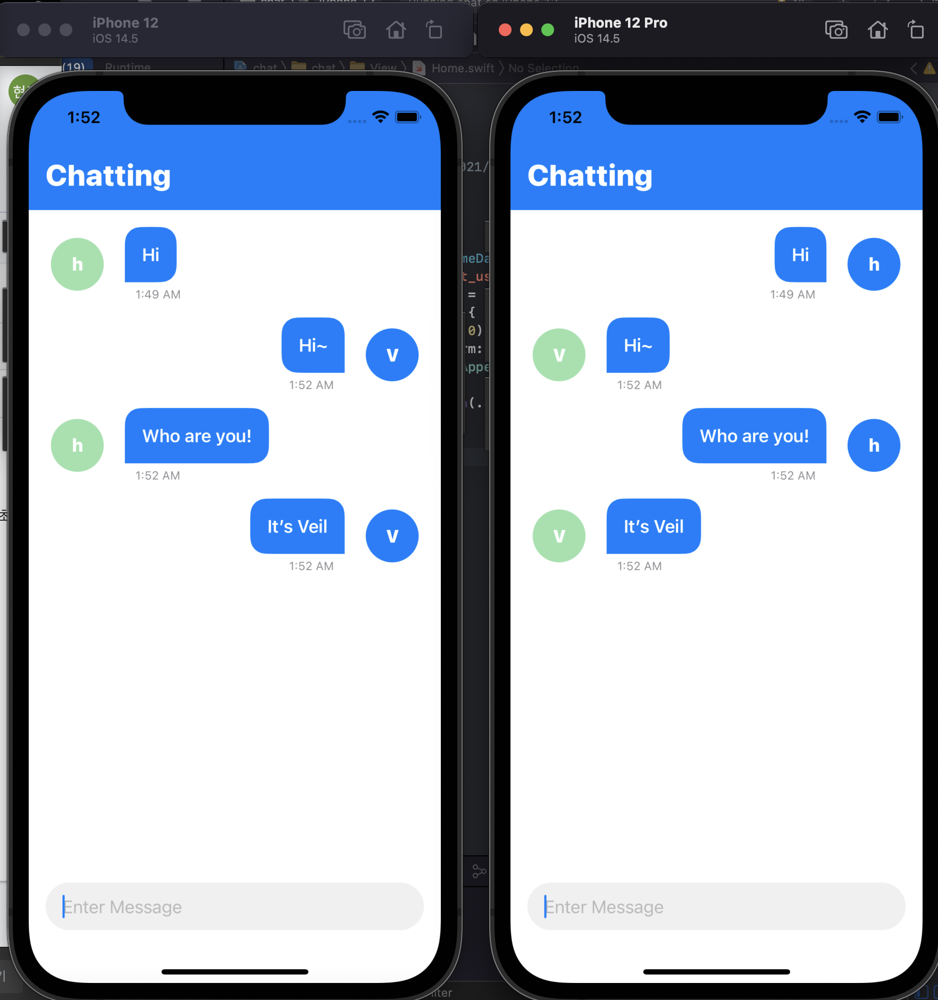

# Chat Tutorial
> 두번째 SwiftUI tutorial, 2021.6.5 ~ 2021.6.6

[SwiftUI Chat App With Firebase](https://www.youtube.com/watch?v=PrasbHixcpU)

* Firebase 연동
* MVVM pattern
* 채팅 입력창
* User name alert로 get Username
* User name의 첫글자로 User profile  
* 하나의 채팅열에서 current user가 아니면 왼쪽 정렬에 맞춰 표시
* Home init에서 Firebase에 저장되어있는 모든 메세지 get

## WIL

